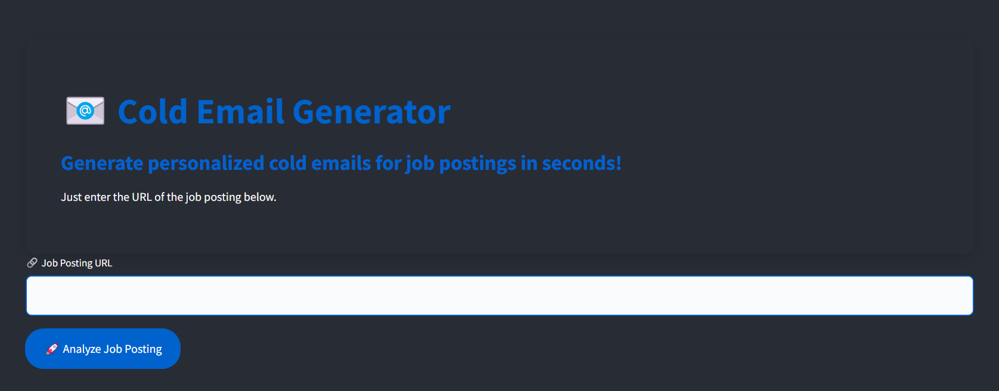
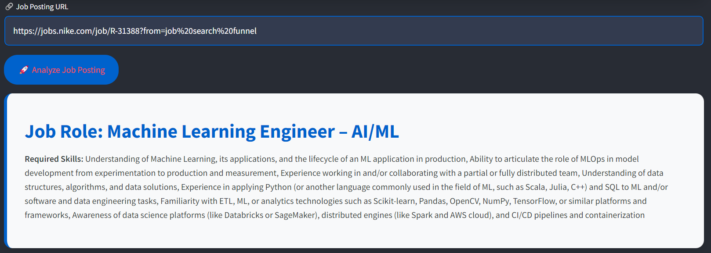
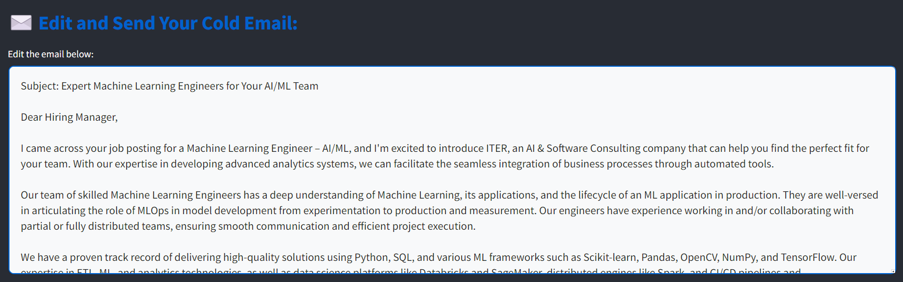

#  📧**LLM-Powered Cold Email Generator** – *Your AI Hiring Wingman!*
 


Looking for skilled employees or trying to land that perfect gig? **Welcome aboard the Cold Email Generator!** 🎉 This app is your ultimate sidekick for extracting job descriptions, crafting compelling emails, and getting in touch with top-notch companies – all powered by AI, delivered with style, and sent through Gmail! 💌

## 🎯 **Why This App?**

In today’s fast-paced world, nobody has time to manually create cold emails from scratch. With **Cold Email Generator**, say goodbye to boring, repetitive work and hello to **personalized**, **professional** cold emails – generated in seconds, powered by **AI**, and customized just for you!

---

## ⚡ **App Superpowers**

### 🧠 **Smart Job Posting Analysis**
Simply paste the URL of a job listing, and boom! Our AI instantly scans the job posting, extracts all the juicy details (like the job title and required skills), and gets you ready to rock.

### 📝 **Auto-Generated Cold Emails**
Based on the extracted details, the app *magically* writes a tailored cold email that’s designed to catch attention! 💥 The email highlights your portfolio, relevant skills, and more – no manual work needed. (*But of course, you can edit it to add your secret sauce!*)

### 📧 **Integrated Gmail API for Smooth Sending**
Why stop at drafting? This app lets you send your cold emails directly using **Gmail**, so you’re just one click away from sending your application (or proposal). All without leaving the app! 🎯

### 🌈 **Sleek and Stunning UI**
This isn't your grandma's email generator. The app's **modern, clean design** (built on **Streamlit**) is easy on the eyes and fun to use. **Dark mode**? ✔️ **Customizable inputs**? ✔️ **Responsive design**? ✔️

---

## 💻 **How It Works** (It’s Magic 🪄)

1. **Enter Job URL**: Paste a job listing URL into the app. Easy.
2. **Analyze & Extract**: The app uses AI to analyze the job post and pull out key details (like the role and skills). Time saved? *Loads.*
3. **Generate Cold Email**: The app writes a tailored cold email for you, using the extracted info and your portfolio. 💬 It’s not just fast, it’s smart.
4. **Edit & Send**: Tweak the email if you like, and send it straight from the app using Gmail. All within seconds!

---

## 🛠 **Under the Hood: Tech Stack**

- **LangChain**: Powers the AI-driven job description analysis.
- **Streamlit**: Smooth UI experience that looks *super cool*.
- **Gmail API**: Handles the email-sending magic.
- **WebBaseLoader**: Extracts job descriptions directly from job post URLs.

---

## 🎨 **Sneak Peek** (Screenshots)

Check out the app in action:

### 1️⃣ **Analyze Job Postings Instantly**  


### 2️⃣ **Auto-Generated Cold Email**  


### 3️⃣ **Effortless Email Sending**  


---

## 🛠️ **Setup Guide (Become a Cold Email Hero)**

Want to give it a spin? Follow these steps to get your app up and running in minutes!

### 1️⃣ Clone this repo

```bash
git clone https://github.com/your-repo/cold-email-generator.git
cd cold-email-generator
```

### 2️⃣ Install dependencies

```bash
pip install -r requirements.txt
```

### 3️⃣ Setup Gmail API (We’re legit 🎯)

Follow this [Gmail API Quickstart Guide](https://developers.google.com/gmail/api/quickstart/python) and grab your `credentials.json`. Pop that file into the root directory of the project.

### 4️⃣ Run the app

```bash
streamlit run app.py
```

And boom! You’re ready to **analyze job postings**, **generate cold emails**, and **send them off** all in one slick app.

---

## 🌟 **Contribute & Collaborate**

Want to make the app even cooler? Feel free to contribute! Fork the repo, create feature requests, or shoot us a pull request. We’re all about growing together!

---

## 📧 **Contact**

Got questions? Feel free to drop me an email at [ramanarayanransingh@gmail.com](mailto:ramanarayanransingh@gmail.com). Or just open an issue on GitHub – I’ve got your back!

---

**Let the Cold Emails Begin!** ✉️🚀✨  
*(Built with AI, Powered by You)*

---
