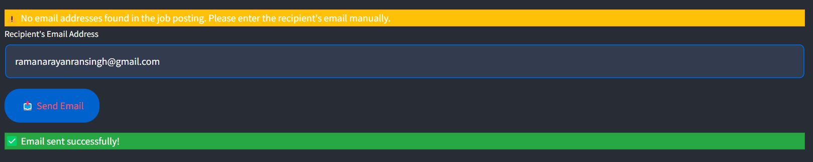

# 🚀 LLM-Powered Cold Email Generator: Your AI Hiring Wingman! 🤖✉️


## 🌟 [Try it live on Render!](https://cold-email-sender.onrender.com)

Dreaming of your next career move or hunting for top-tier talent? Say hello to the **Cold Email Generator** - your AI-powered sidekick in the job market jungle! 🎭💼

## 🎬 Lights, Camera, Action!

Picture this: You're scrolling through job listings, coffee in hand, when suddenly - BAM! 💥 You spot the perfect opportunity. But wait, how do you stand out in a sea of applicants? Enter the Cold Email Generator, stage left! 🎭

With just a few clicks, you'll go from "Who's that?" to "We need to hire this person NOW!" Faster than you can say "You're hired!" 🏆

## 🌈 Why You'll Fall Head Over Heels

1. **Time-Bending Speed**: Generate personalized emails faster than a superhero costume change! ⚡
2. **AI-Powered Charm**: Our AI doesn't just write emails; it crafts love letters to your dream job! 💘
3. **One-Click Wonder**: From job post to "Email Sent" in less time than it takes to perfect your LinkedIn selfie! 📸
4. **Gmail Integration**: Smoother than your best pick-up line! 😉

## 🎭 The Magic Behind the Curtain

1. **Job URL Sorcery**: Paste a job listing URL and watch the magic unfold!
2. **AI Mind-Reading**: Our AI scans the job post faster than you can say "hire me!"
3. **Email Alchemy**: Transform boring details into golden opportunities!
4. **Send with Swagger**: Hit that send button and strut your stuff!

## 🛠️ Techie Goodness (For the Geeks and Geekettes)

- **LangChain**: The brains of the operation!
- **Streamlit**: Making our app look sexier than a well-formatted resume!
- **Gmail API**: Sliding into inboxes with style!
- **WebBaseLoader**: Extracting job details like a data ninja!

## 📸 Sneak Peek (Paparazzi Approved)

### 1️⃣ Job Analysis in Action


### 2️⃣ Email Magic Happening


### 3️⃣ Sending Emails Like a Boss


## 🏗️ Build Your Own Email Empire

Want to run this bad boy locally? Follow these steps:

1. **Clone the repo** (Steal our code... we mean, collaborate! 😉)
   ```bash
   git clone https://github.com/your-repo/cold-email-generator.git
   cd cold-email-generator
   ```

2. **Install dependencies** (Get those digital muscles ready!)
   ```bash
   pip install -r requirements.txt
   ```

3. **Setup Gmail API** (Let's get official 📜)
   - Follow the [Gmail API Quickstart Guide](https://developers.google.com/gmail/api/quickstart/python)
   - Drop that shiny `credentials.json` in your project root

4. **Fire it up!** (Let's goooo! 🚀)
   ```bash
   streamlit run app.py
   ```

## 🌍 See It In Action

Can't wait to try? We've got you covered! Check out our live demo:

🔗 [Cold Email Generator on Render](https://cold-email-sender.onrender.com)

No installation required - just click and conquer! 💪

## 🤝 Join the Email Revolution

Got ideas? We're all ears! Fork, feature-request, or pull-request your way into our hearts. Let's make cold emails hot again! 🔥

## 📬 Slide Into Our DMs

Questions? Thoughts? Love letters? 💌

📧 Email: [ramanarayanransingh@gmail.com](mailto:ramanarayanransingh@gmail.com)
🐙 GitHub Issues: Just open one, we don't bite!

---

**Ready to charm your way into your dream job? Let's get emailing!** 📤✨

*Powered by AI, Fueled by Your Ambition, Deployed with ❤️ on Render*
